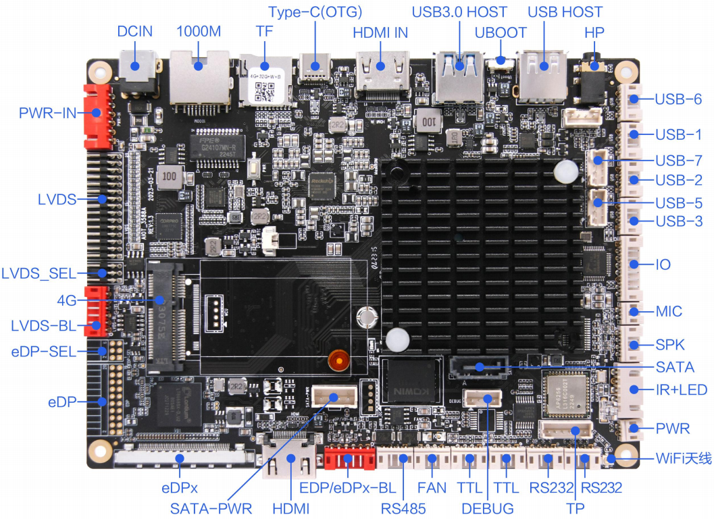
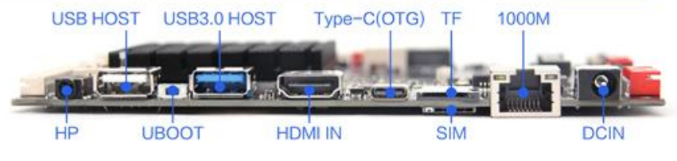
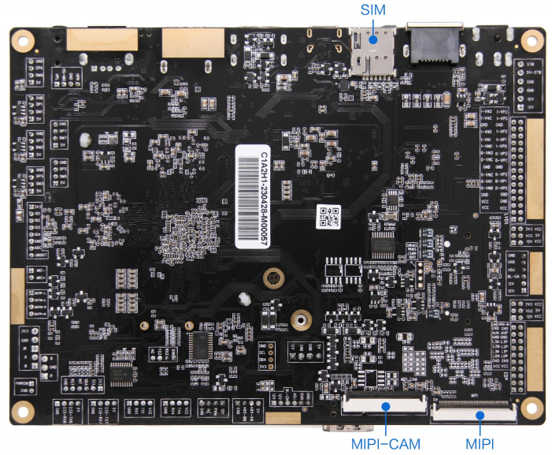

# AIOT-3588A (Rockchip RK3588) 玩耍记录

```
Something I hope you know before go into the coding~
First, please watch or star this repo, I'll be more happy if you follow me.
Bug report, questions and discussion are welcome, you can post an issue or pull a request.
```







## 相关站点

* [视美泰主官网](https://www.shimeta.com.cn)
* [视美泰开源技术资料社区](http://forum.shimetapi.cn/wiki/OpenSource_OH/)
* [视美泰OpenHarmony入门指引(密码123456)](https://www.showdoc.com.cn/openharmony/0)

## 目录

* [开发板基本信息](docs/开发板基本信息.md)
* [uboot适配](docs/uboot适配/uboot适配.md)
* [驱动](docs/驱动.md)
    * [网卡驱动](docs/驱动/网卡驱动/网卡驱动.md)
    * [WIFI驱动](docs/驱动/WLAN驱动/WIFI驱动.md)
    * [蓝牙驱动](docs/驱动/蓝牙驱动/蓝牙驱动.md)
    * [LED驱动](docs/驱动/LED驱动/LED驱动.md)
    * [USB驱动](docs/驱动/USB驱动/USB驱动.md)
    * [HDMI驱动](docs/驱动/HDMI驱动/HDMI驱动.md)
    * [SATA驱动](docs/驱动/SATA驱动/SATA驱动.md)
    * [音频驱动](docs/驱动/音频驱动/音频驱动.md)
    * [按键驱动](docs/驱动/按键驱动/按键驱动.md)
    * [RTC时钟驱动](docs/驱动/RTC时钟驱动/RTC时钟驱动.md)
    * [风扇驱动](docs/驱动/风扇驱动/风扇驱动.md)
    * [电源驱动](docs/驱动/电源驱动/电源驱动.md)
    * [看门狗](docs/驱动/看门狗/看门狗.md)
* [系统](docs/系统.md)
    * [Android12](docs/系统/Android12/Android12.md)
    * [Ubuntu22](docs/系统/Ubuntu22/Ubuntu22.md)
    * [Ubuntu20](docs/系统/Ubuntu20/Ubuntu20.md)

## 免责声明

* 与官方无任何关联
* 仅学习交流，无任何商业用途
